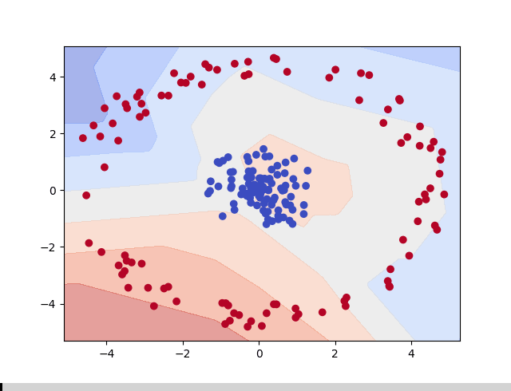

# Circle Separation Neural Network 


**Posted on October 10, 2025 | Programming Project**





Excited to share a fun machine learning project I built using PyTorch! This neural network learns to separate points from two concentric circles—one inner and one outer—through binary classification. It's a great way to visualize how decision boundaries evolve during training.


## Project Overview


The dataset consists of 200 points: 100 randomly generated inside a small circle (radius up to 1.5) labeled as 0, and 100 outside in a larger ring (radius 4 to 5) labeled as 1. The model trains over 300 epochs, and I captured the decision boundary at each step to see the learning process unfold.


 * *Tech Stack: * * PyTorch (Neural Network  & Training), Matplotlib (Visualization), NumPy (Data Generation)

## My personal understanding of why and how this model works

In the diagram showing the model learning you can see that the decision boundary looks not like a smooth circle or oval but like a polygon with limited number of edges. This is because for my network I am using 10 neurons in layer 1. Each neuron learns a simple straight line which is combined using the Relu function, this function acts as a switch so that negative values are null but positive values remain the same. the Sigmoid function then is applied to the output of layer 2 which essentially scales the values to between 0 and 1 (a reminder our target values are 0 and 1 respective to the group). Once we have our prediction from the model we need to calculate the loss. In this example the Binary Cross-Entropy Loss function is used to determine how wrong our prediction is. This makes it so that the loss is calculated with respect to how confident the model was so penalises confidently wrong prediction much more. The loss is the used to re-tune the weights and biases via gradient descent, it first calculates the steepest gradient and takes a step in the opposite direction. the size of the step is determined by the learning rate which balances the speed and stability of the learning so that it doesn't overshoot the bottom of the valley that it is trying to reach causing it to never learn correctly. The optimizer is unable to see the entire valley and only sees the gradient of the current position so if the valley followed a winding downward path a step too large in the initial downward direction may not take it to the place we want it to be.

 ## Model Architecture - code with torch


The network is a simple feedforward model: a linear layer from 2 inputs (x, y coordinates) to 10 hidden units with ReLU activation, followed by another linear layer to 1 output with sigmoid for binary classification.


```python

class ClusterSplitter(nn.Module):

    def  _ _init _ _(self):

        super(). _ _init _ _()

        self.layer _1 = nn.Linear(2, 10)

        self.layer _2 = nn.Linear(10, 1)


    def forward(self, x):

        out = torch.relu(self.layer _1(x))

        out = torch.sigmoid(self.layer _2(out))

        return out

```


 ## Training Process


Using Binary Cross-Entropy Loss and SGD optimizer with lr=0.1. Here's a snippet of the training loop, which also generates plots of the decision boundary:


```python

for epoch in range(epochs):

    y _pred = model(x)

    optimizer.zero _grad()

    loss = criterion(y _pred, y)

    loss.backward()

    optimizer.step()

    plot _decision _boundary(model, x, y, epoch)

    if epoch % 30 == 0:

        print(f"completed {epoch} epochs with error of {loss}")

```


Sample training output (loss decreasing over epochs):

```

completed 0 epochs with error of 0.6931

completed 30 epochs with error of 0.5123

completed 60 epochs with error of 0.2345

... (continues to converge around epoch 150)

```


 ## Key Insights


 - The decision boundary starts chaotic and gradually forms a clear separation between the circles.

 - Visualizing every epoch highlights the non-linear learning of the network.

 - This project reinforced my understanding of activation functions and loss landscapes in classification tasks.


 ## Challenges  & Learnings


Initially, the model struggled with the circular separation due to the linear layers, but the hidden layer with ReLU allowed it to approximate the non-linear boundary. I experimented with learning rates—too high caused oscillations. Overall, it's a solid intro to PyTorch for geometric data tasks.


